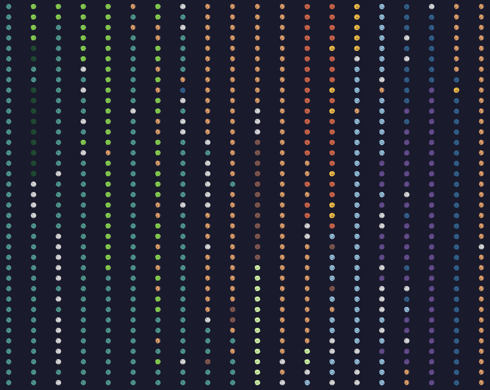

# By Tooth And Beak



[▶ Watch demo(phase 1)](doc/demo1.mov)

An interactive visualization of bird diets using a dataset from the Avian Diet Database and bird images from Cornell Lab of Ornithology. Each dot is a bird species, positioned in 2D space by diet similarity, meaning birds that eat similar things cluster together.

Hover over a dot to see the bird's name and top prey items, and click to trigger an animation based on what it eats.

## Features

This project includes a number of experiments and features to represent the bird diet dataset: 
- **UMAP / Grid toggle** — switch between a dimensionality-reduced diet space and a linearly rasterized grid view of birds
- **Tooltips** — bird name, dominant prey class, and top 5 prey items with percentages
- **Animations** — p5.js animations per prey class 
- **Predator arrows** — 36 bird-eating birds shoot darts toward each of their prey species on the map

## Stack

- [D3.js](https://d3js.org) — data binding, layout, zoom
- [p5.js](https://p5js.org) — click animations
- Python — data processing pipeline (UMAP, diet vector construction)

## Data

This project uses the original download from the Avian Diet Database, then processes into additional csv/json files
- `data/umap_coords.csv` — bird species with 2D UMAP coordinates
- `data/diet_vectors.csv` — fractional diet decomposition (in percentage) per species
- `data/aves_prey_links.json` — predator–prey links for bird-eating birds
- `cutouts/` — bird image cutouts
- `dots/` — colored dot icons per prey class

## Running locally

```bash
pip install -r requirements.txt
python3 -m http.server 8000
```

Then open `http://localhost:8000`.
